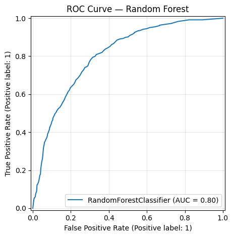

# Customer Churn Prediction

A machine learning pipeline to predict telecom customer churn, with emphasis on correctly identifying churners (high Recall on minority class).

📓 [View full analysis on Kaggle](https://www.kaggle.com/code/swyamsreepatra/telcocustomerchurn)

---

## Problem Statement

Customer churn — when customers stop using a service — directly impacts revenue. Retaining an existing customer costs significantly less than acquiring a new one. This project builds a classification model to identify at-risk customers before they churn, enabling proactive retention strategies.

---

## Dataset

- **Source:** IBM Telco Customer Churn Dataset (via Kaggle)
- **Size:** ~7,000 rows, 20 features
- **Target:** `Churn` (Yes / No) — ~27% positive class (imbalanced)

---

## Pipeline

```
Raw Data → Cleaning → EDA → Encoding → Train/Test Split → SMOTE → Random Forest → Evaluation → ROC-AUC → CV → Feature Importance
```

### Key decisions and why

| Step           | Decision                                          | Reason                                                                         |
|----------------|---------------------------------------------------|--------------------------------------------------------------------------------|
| Missing values | Dropped 11 blank `TotalCharges` rows              | < 0.2% of data — negligible loss                                               |
| Encoding       | LabelEncoder for binary cols, One-Hot for nominal | Avoids false ordinal relationships in multi-class features                     |
| Split          | Stratified 75/25 **before** SMOTE                 | Prevents synthetic samples from leaking into the test set                      |
| Imbalance      | SMOTE on training data only                       | Generates synthetic minority samples vs. simple duplication                    |
| Model          | Random Forest (no `class_weight`)                 | SMOTE handles imbalance at data level — double-correcting would bias the model |
| Validation     | Stratified 5-fold CV inside `ImbPipeline`         | SMOTE applied per fold — prevents data leakage across CV splits                |

---

## Results

| Metric                     | Value                                    |
|----------------------------|------------------------------------------|
| **Recall (churned class)** | 0.82 — captures 82% of at-risk customers |
| **AUC Score**              | 0.805                                    |
| **CV Mean Recall**         | 0.581                                    |
| **CV Std Dev**             | 0.045                                    |

- Metric prioritized: **Recall** — a missed churner (false negative) costs more than a false alarm
- Customers on **month-to-month contracts** with **short tenure** and **high monthly charges** are most at risk

### Feature Importance


### ROC-AUC Curve



---

## Tech Stack

- Python, Pandas, NumPy
- Scikit-learn (Random Forest, StratifiedKFold, cross-validation)
- Imbalanced-learn (SMOTE, ImbPipeline)
- Matplotlib, Seaborn

---

## Requirements

```sh
pip install numpy pandas matplotlib seaborn scikit-learn imbalanced-learn
```

---

## How to Run

1. Clone the repository:
```sh
git clone https://github.com/Swayam0804/Customer-Churn-Prediction.git
cd Customer-Churn-Prediction
```

2. Install dependencies:
```sh
pip install numpy pandas matplotlib seaborn scikit-learn imbalanced-learn
```

3. Run the notebook:
```sh
jupyter notebook customer-churn-prediction.ipynb
```

Or view the full analysis on Kaggle: [https://www.kaggle.com/code/swyamsreepatra/customer-churn-prediction](https://www.kaggle.com/code/swyamsreepatra/telcocustomerchurn)
